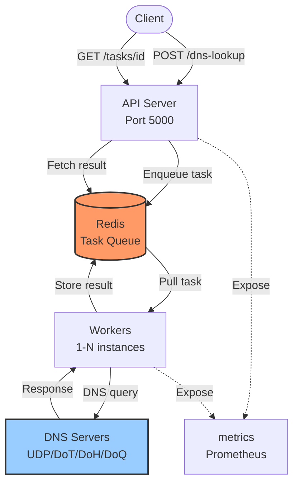

# Architecture

High-level system design and data flow.

---

## 🏗️ System Overview

```
Client → API Server → Asynq (Redis) → Worker Pool → DNS Servers
                         ↓                ↓
                      Results ← ─ ─ ─ ─ ─ ┘
```

---

## 📊 Components



---

## 🔄 Request Flow


```
┌─────────┐  1. POST /dns-lookup         ┌─────────────┐
│ Client  │─────────────────────────────>│  API Server │
└─────────┘                              │  chi router │
                                         └──────┬──────┘
                                                │ 2. Validate
                                                │ 3. Rate limit
                                                ▼
                                         ┌─────────────┐
                                         │   Asynq     │
                                         │   Enqueue   │
                                         └──────┬──────┘
                                                │ 4. Store task
                                                ▼
┌─────────┐  202 {task_id}               ┌──────────────┐
│ Client  │<─────────────────────────────│    Redis     │
└────┬────┘                              └──────┬───────┘
     │                                          │ 5. Dequeue
     │ 6. Poll GET /tasks/{id}                  ▼
     │                                   ┌──────────────┐
     │                                   │  Worker Pool │
     │                                   │  (dnsproxy)  │
     │                                   └──────┬───────┘
     │                                          │ 7. Query DNS
     │                                          ▼
     │                                   ┌──────────────┐
     │                                   │  DNS Servers │
     │                                   │ UDP/TCP/TLS/ │
     │                                   │ HTTPS/QUIC   │
     │                                   └──────┬───────┘
     │                                          │ 8. Response
     │                                          ▼
     │                                   ┌──────────────┐
     │                                   │    Redis     │
     │                                   │ Store result │
     │                                   └──────┬───────┘
     │                                          │
     ▼                                          │
┌───────────────────────────────────────────────┘
│  9. Fetch result
▼
{task_status: SUCCESS, task_result: {...}}
```

---

## 🧩 Components

| Component | Technology | Responsibility | Scalability |
|-----------|-----------|----------------|-------------|
| API Server | chi + Tollbooth | HTTP routing, rate limiting | Stateless, horizontal |
| Task Queue | Asynq + Redis | Task persistence, distribution | Redis cluster |
| Worker Pool | Go + dnsproxy | DNS query execution | Configurable concurrency |
| Storage | Redis | Task state, results | Redis cluster |
| Metrics | Prometheus | Observability | Pull-based |

---

## 🔁 Task Lifecycle


---

## 🚀 Deployment Architectures

### Single Instance (Development)
```
┌──────────────────────────────────┐
│       Docker Compose             │
│                                  │
│  ┌──────┐  ┌────────┐  ┌──────┐  │
│  │ API  │→ │ Redis  │← │Worker│  │
│  └──────┘  └────────┘  └──────┘  │
└──────────────────────────────────┘
```

### Multi-Instance (Production)

```
      ┌──────────┐
      │  LB/Nginx│
      └─────┬────┘
            │
    ┌───────┴───────┐
    ▼               ▼
┌─────────┐    ┌──────────┐
│  API-1  │    │  API-2   │
└───┬─────┘    └────┬─────┘
    │               │
    └───────┬───────┘
            ▼
     ┌─────────────┐
     │Redis Cluster│
     └──────┬──────┘
            │
  ┌─────────┼────────┐
  ▼         ▼        ▼
┌──────┐┌──────┐┌──────┐
│Work-1││Work-2││Work-N│
└──────┘└──────┘└──────┘
```

### Kubernetes (Scalable)


---

## 🔧 Protocol Stack

| Layer | Component | Implementation |
|-------|-----------|----------------|
| API | HTTP Router | chi |
| Queue | Task Management | Asynq |
| Worker | Concurrency | Go goroutines |
| DNS | Multi-Protocol | AdGuard dnsproxy |
| Transport | UDP/TCP/TLS/HTTPS/QUIC | miekg/dns, crypto/tls, net/http, quic-go |

---

## 📈 Scaling

| Component | Horizontal | Vertical | Limit |
|-----------|-----------|----------|-------|
| API | ✅ Stateless | Low CPU/Memory | Unlimited |
| Worker | ✅ Task-based | Moderate CPU | DNS rate limits |
| Redis | ⚠️ Cluster needed | High memory | 10k req/s (single) |

**Concurrency:** `Total = Workers × MAX_WORKERS`

---

## ⚡ Performance

> 🔬 **Benchmarks in progress** - Comprehensive performance comparison coming soon.

---

## 🔐 Security Layers

```
Internet → TLS (Reverse Proxy) → Auth (optional) → API → Internal Network (Redis/Workers)
```

1. TLS termination at reverse proxy
2. Rate limiting (proxy + API)
3. Optional authentication
4. Network isolation for Redis
5. Input validation

---

## ❌ Error Handling

| Error | HTTP Code | Behavior |
|-------|-----------|----------|
| Invalid request | 400 | Immediate rejection |
| Rate limit | 429 | Backoff required |
| No workers | 503 | Retry later |
| DNS timeout | 200 | Per-server error in result |

**Philosophy:** API never fails for DNS errors - each server independent, partial success allowed.

---

## 📊 Monitoring

```
API/Workers → /metrics → Prometheus → Grafana → Alertmanager
```

See [Monitoring Guide](06-monitoring.md) for full details.

---

## 📚 See Also

- [API Reference](03-api.md) - REST API documentation
- [Configuration](05-configuration.md) - Config options
- [Monitoring](06-monitoring.md) - Metrics and alerting
